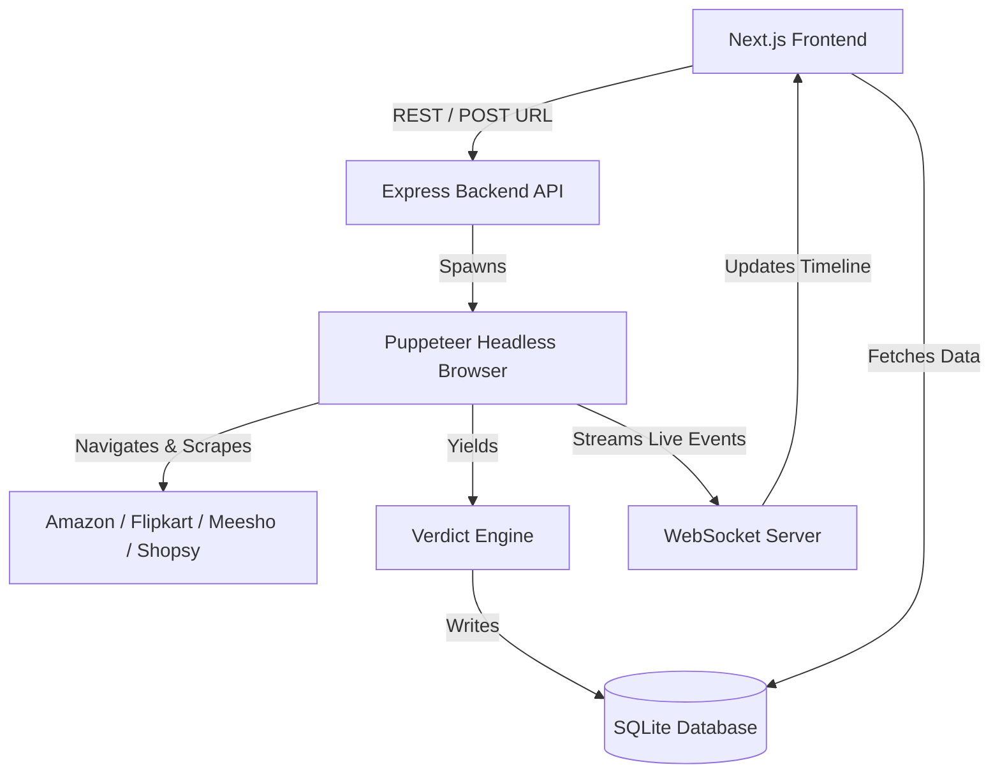

# PrizeIncubator

Honest price intelligence — verified by an autonomous browser agent, not just scraped from HTML. 

PrizeIncubator is a real-world e-commerce verification engine that bypasses deceptive marketing. It uses a headless browser agent to physically enter delivery pincodes, apply hidden coupons, and stack bank offers at the checkout stage to determine the **true final price** of a product across Amazon, Flipkart, Meesho, and Shopsy.

## Badges


## Overview

Modern e-commerce is filled with deceptive pricing: inflated MRPs designed to fake a 50% discount, coupons hidden deep in the checkout flow, and conditional bank offers. Static web scrapers simply grab the "listed price" and fail to capture these real-world economics.

**PrizeIncubator solves this by simulating a real human.**
When you track a product URL, an autonomous browser agent is launched in the background. It navigates to the page, enters your local delivery pincode to verify serviceability, expands collapsed offer panels, applies optimal coupons, and calculates the true final price. Finally, it scores the deal against historical data to detect fake discounts, presenting you with a ranked feed of actionable, human-approved deals.

## Features

### Core Features
* **Live Agent Visualizer:** Watch the autonomous browser agent execute steps in real-time via a WebSocket-powered timeline (e.g., navigating, clicking, entering pincodes).
* **True Price Calculation:** Automatically stacks checkout coupons and credit card/bank offers to find the absolute lowest price.
* **Fake Discount Detection:** Cross-references pricing history to flag "MRP Inflated" scams where the base price was artificially raised right before a sale.
* **Cross-Platform Arbitrage:** Automatically groups identical products across Amazon, Flipkart, Meesho, and Shopsy to highlight side-by-side pricing disparities.

### Advanced Features
* **Human-in-the-Loop Architecture:** Agents are strictly sandboxed. They navigate up to the final checkout review stage, but a human must click "Approve & Open Checkout" to complete the payment. 
* **Live WebSocket Broadcasts:** Real-time event streaming (`agent_start`, `agent_step`, `agent_verdict`) from the backend to the frontend UI.
* **Shareable Deal Receipts:** Generates beautiful, exportable PNG receipts for verified deals.

### User Features
* **Ranked Deals Feed:** A clean dashboard that sorts verified deals by percentile (lowest first).
* **Approval Queue:** A dedicated workflow tab for managing, snoozing, or approving verified deals.
* **Global Settings:** Configure global delivery pincodes, target price thresholds, and agent notification preferences.
* **Dark/Light Mode:** A fully responsive, modern CSS-variable-based theme system.

## Tech Stack

| Layer | Technology | Purpose |
|---|---|---|
| **Frontend** | Next.js (React), TailwindCSS | High-performance, responsive UI and component rendering. |
| **Backend** | Node.js, Express | REST API, WebSocket server, and agent orchestration. |
| **Database** | SQLite (`sql.js`) | Lightweight, persistent local storage for products, history, and verdicts. |
| **Automation** | Puppeteer, webcmd | Headless browser execution, DOM manipulation, and stealth scraping. |
| **Real-time** | `ws` (WebSockets) | Live bidirectional streaming of agent execution logs to the frontend. |

## System Architecture



## Project Structure

```text
PrizeIncubator/
├── backend/
│   ├── src/
│   │   ├── routes/          # Express API route handlers (products, deals, compare, settings)
│   │   ├── schema/          # TypeScript interfaces for Verdicts and DB models
│   │   ├── db.ts            # SQLite database initialization and queries
│   │   └── index.ts         # Main Express server and WebSocket broadcaster
│   ├── chrome/              # Local headless Chrome binaries for Puppeteer
│   └── package.json
├── frontend/
│   ├── app/
│   │   ├── components/      # Modular React components (AgentTimeline, CompareCard, ReceiptStrip)
│   │   ├── globals.css      # Tailwind directives and CSS variables for Dark/Light themes
│   │   ├── layout.tsx       # Root Next.js layout and ThemeProvider
│   │   └── page.tsx         # Main application shell and tab routing
│   ├── public/              # Static assets and generated illustrations
│   └── package.json
└── shared/
    └── verdict-schema.json  # Shared JSON schema defining the standard Verdict object
```

## Prerequisites

Before running the project, ensure you have the following installed:
* **Node.js** (v18.0.0 or higher)
* **npm** (v9.0.0 or higher)
* (Optional) Windows OS for the local pre-packaged Chrome binary, or a standard Chromium installation for Linux/Mac.

## Installation

1. **Clone the repository:**
   ```bash
   git clone [ADD YOUR REPOSITORY URL]
   cd PrizeIncubator
   ```

2. **Install Backend Dependencies:**
   ```bash
   cd backend
   npm install
   ```

3. **Install Frontend Dependencies:**
   ```bash
   cd ../frontend
   npm install
   ```

## Environment Variables

Create a `.env` file in the `backend/` directory:

```env
# The port the Express API will run on
PORT=3001

# Path to the SQLite database file
DATABASE_PATH=./data/prize-incubator.db

# The URL of the Next.js frontend for CORS policies
FRONTEND_URL=http://localhost:3000
```

## Running the Project

You will need two terminal windows to run the frontend and backend concurrently.

**1. Start the Backend API & WebSocket Server:**
```bash
cd backend
npm run dev
```
*(Runs on http://localhost:3001)*

**2. Start the Frontend Next.js App:**
```bash
cd frontend
npm run dev
```
*(Runs on http://localhost:3000)*

## API Documentation

| Method | Endpoint | Description |
|---|---|---|
| `POST` | `/api/products` | Tracks a new product URL. Spawns the agent and returns a Verdict. |
| `GET` | `/api/products` | Returns a list of all tracked products and their latest verdicts. |
| `PATCH` | `/api/products/:id` | Updates specific product preferences (notification threshold, group ID). |
| `POST` | `/api/products/:id/approval`| Updates the human-in-the-loop approval status (`approve`, `snooze`, `reject`). |
| `GET` | `/api/deals` | Returns all products sorted by best percentile value. |
| `GET` | `/api/compare/:groupId` | Returns grouped products for cross-platform arbitrage comparison. |
| `GET` | `/api/settings` | Returns global system settings and scraping statistics. |
| `PUT` | `/api/settings` | Updates global settings (e.g., global Pincode). |

### Example Request (`POST /api/products`)
```json
{
  "url": "https://www.amazon.in/dp/B09V48Z769",
  "pincode": "177001"
}
```

## Database

The project utilizes a lightweight **SQLite** database (`sql.js`) stored locally in the `backend/data/` directory. 

**Core Tables:**
* `products`: Stores tracked URLs, metadata, settings, and cross-platform `product_group_id` links.
* `price_history`: Appends a new row every time an agent scrapes a product, tracking the listed price vs true final price over time.
* `verdicts`: Stores the raw JSON output of the agent's decision engine (including applied coupons and reasoning).

## Authentication & Security

* **Human-in-the-Loop Gateway:** The architecture strictly isolates agent navigation from payments. Automated checkout submission is hard-blocked. The system relies on human authorization (via the UI) to complete transactions.
* **CORS Restrictions:** The backend enforces strict CORS policies, only accepting requests from the declared `FRONTEND_URL`.

## Screenshots / Demo


*The PrizeIncubator dashboard featuring the Live Agent Timeline, Fake Discount Badges, and Cross-Platform comparisons.*

**Live Demo:** [ADD YOUR DEMO URL]  
**Video Demo:** [ADD YOUR VIDEO URL]

## Usage

1. **Configure Location:** Navigate to the "Settings" tab and enter your local delivery Pincode.
2. **Track a Deal:** Navigate to the "Deals" or "Ledger" tab and paste a product URL from Amazon, Flipkart, Meesho, or Shopsy into the Track bar.
3. **Watch the Agent:** The Live Agent Visualizer on the right will instantly stream the headless browser's actions (e.g., "Navigating to Amazon", "Applying Coupon: AUDIO500").
4. **Review Verdict:** A Receipt Strip will generate, showing the true final price and flagging if the MRP was artificially inflated.
5. **Approve:** Click "Approve & Open Checkout" to securely finalize the purchase yourself.

## Known Issues / Limitations

* **Headless Detection:** Aggressive bot-protection (e.g., CAPTCHAs) on certain platforms may occasionally block the Puppeteer agent from completing a full run. The system utilizes `puppeteer-extra-plugin-stealth` to mitigate this, but failures can still occur.
* **Payment Automation:** By design, the agent does not store or process payment information.

## Future Improvements

* **Already Implemented:** Multi-platform support (Amazon, Flipkart, Meesho, Shopsy), Cross-platform price comparison, SQLite persistence.
* **Planned Improvements:** 
  - Automated recurring chron-job scraping to build historical price charts in the background.
  - Proxy rotation integration to further bypass headless browser blocks.

## Contributing

1. Fork the repository
2. Create your feature branch (`git checkout -b feature/AmazingFeature`)
3. Commit your changes (`git commit -m 'Add some AmazingFeature'`)
4. Push to the branch (`git push origin feature/AmazingFeature`)
5. Open a Pull Request

## License

[ADD LICENSE INFORMATION]

## Authors / Contributors

[ADD CONTRIBUTORS]

## Acknowledgements

* **[Puppeteer Extra Stealth](https://github.com/berstend/puppeteer-extra/tree/master/packages/puppeteer-extra-plugin-stealth):** For robust headless browser evasion.
* **[TailwindCSS](https://tailwindcss.com/):** For flexible, modern UI styling.
